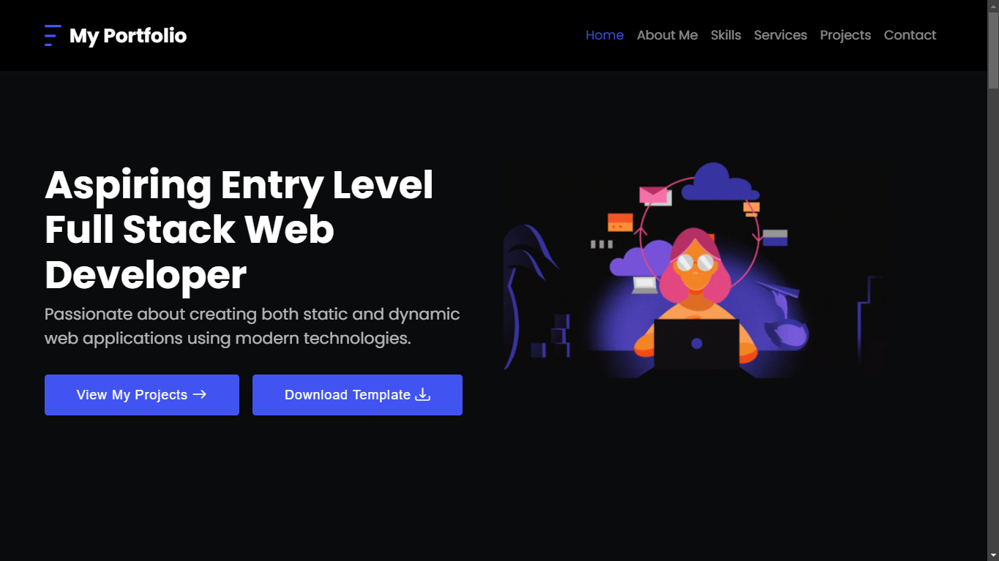

# codewithjosh-template-portfolio

A sleek, responsive, and customizable portfolio template designed by **Josiah Danielle Gallenero**. This portfolio template is built using **HTML**, **CSS**, **Bootstrap 5**, and integrates various resources like **Google Fonts**, **Font Awesome**, and **Bootstrap Icons**. It's a perfect starting point for anyone looking to create a personal online presence or showcase their work.

## 🚀 Features

- **Responsive Design**: Works seamlessly across all devices (desktop, tablet, mobile).
- **Aesthetic Layout**: Elegant and minimalistic design focused on content presentation.
- **Bootstrap 5**: Uses the latest Bootstrap framework for modern, responsive UI elements.
- **Smooth Animations**: Integrates **AOS (Animate On Scroll)** library for beautiful scroll animations.
- **Font Awesome & Bootstrap Icons**: For clean and customizable iconography.
- **Easy to Customize**: Easily change the content and layout to fit your personal brand.

## 📸 Screenshots



## 🎯 Features in Detail

- **Home Section**: A personalized welcome section with a call-to-action button that redirects to the projects section.
- **About Me**: A dedicated section where you can introduce yourself, add an image, and highlight your skills.
- **Skills & Services**: Display your core skills and services with icon-based cards.
- **Projects**: Showcase your projects with descriptions and links to the live projects or repositories.
- **Contact Section**: Provides a form for users to get in touch with you directly.
- **Footer**: Includes social media links and your GitHub profile link.

## 🛠️ Tech Stack

- **HTML5**
- **CSS3**
- **JavaScript**
- **Bootstrap 5**
- **AOS Library** (for animations)
- **Font Awesome**
- **Bootstrap Icons**

## 💻 Installation

To use this template, you can either clone it or download the repository. Follow the steps below to get started:

### Clone the Repository

```bash
git clone https://github.com/anyasauce/codewithjosh-template-portfolio.git
